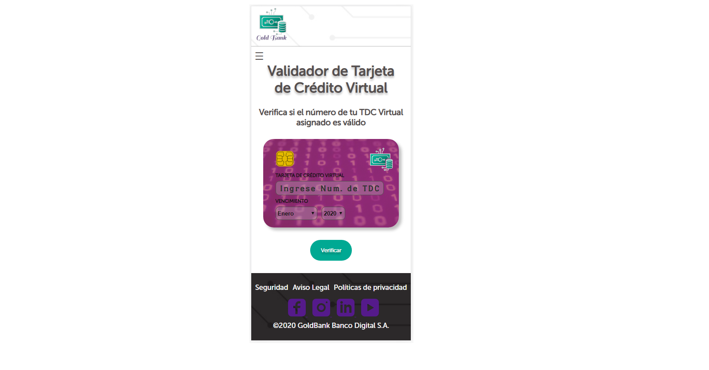
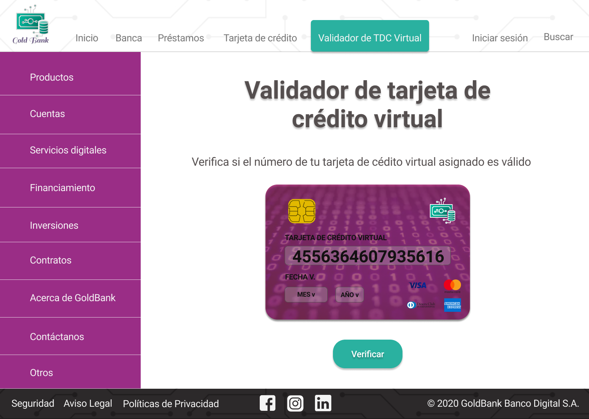

## GoldBank Banco digital S.A

#### Resumen
Implementación de algoritmo de Luhn para validar el número de tarjeta de crédito virtual generado automáticamente en la plataforma web del banco, por los clientes que la soliciten.

#### Investigación UX

El producto está dirigido a los actuales y futuros usuarios de la fintech GoldBank que solicitan su tarjeta de crédito virtual directamente en la plataforma gestionada por la página web del banco donde se les genera el número de TDC virtual automáticamente.

Permite al usuario comprobar que el número de TDC asignado no esté errado y que una vez le sea aprobada su solicitud, pueda hacer uso de ella con confianza y tranqulidad.
Además evita errores al vincular el número generado automáticamente por el sistema con la TDC en físico en caso de que el usuario la solicite para hacer retiros en alguna entidad bancaria asociada a GoldBank, o hacer uso de ella en distintos establecimientos.

Le brinda al usuario completa libertad y autonomía al gestionar su tarjeta de credito en la página web.

Mi primer enfoque en la solución de éste problema se desviaba un poco de la temática principal así que me sugirieron que priorizara el objetivo del proyecto, es así que cambié el la visión que tenía inicialmente y opté por aplicar la validación a tarjetas de credito virtuales.

Al empezar a trabajar en el código de validación no estaba del todo organizada, tenía muchas a las que debía poner atención pero no sabía por donde empezar, así que otra sugerencia realmente útil fue que desglozara el problema que estaba resolviendo en ese momento en una lista de tareas, que en un principio contaba con 9 puntos a realizar y al final terminó alargándose a alrededor de 24 puntos.

Después de pasar mi prototipo en papel a la herramienta Figma me sugirieron que el diseño de mis pantallas no debía parecer una típica presentación con diapositivas, así que en varias oportunidades tuve que cambiar el diseño en ésta herramienta, hasta llegar a un prototipo final que sí se adecuaba más a lo que yo quería presentar.

Figma [enlace](https://www.figma.com/file/6EzsnsJ1XO2riurFfKPAIW/cardValid?node-id=173%3A1)